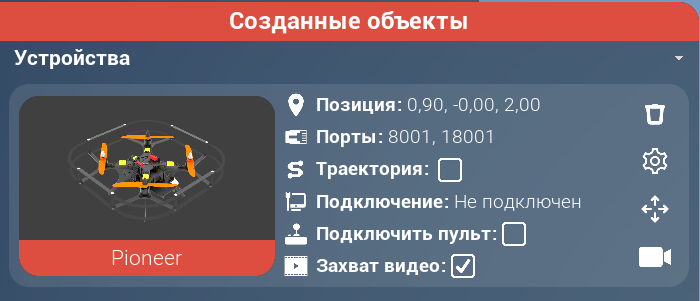

# Задание "навигация в лесу". Симулятор автономных полётов.
## 📌 Общие правила
В вашем распоряжении один квадрокоптер (Пионер) с камерой и один наземный робот (Геобот).
* В вашем распоряжении **один квадрокоптер** (Пионер) с камерой и **один наземный робот** (Геобот).
* Вам необходимо разработать алгоритм сканирования лестной местности с помощью Пионера, построить маршрут для Геобота и успешно довести его из точки А в точку Б.
* Ограничений на порядок действий нет: можно сначала просканировать местность дроном, затем вести робота, либо делать это одновременно.

## 🚀 Соревновательная среда
Лесная местность включает различные препятствия: река с мостом (по которому может проехать Геобот), брёвна, камни и извилистую тропинку. Важно, что тропинка достаточно длинная и извилистая, поэтому, следуя ей проще добраться цели, но путь занимает большее время.

## ⏳ Оценка решений
* Время засчитывается от запуска моторов Пионера до момента, когда Геобот достигнет зоны финиша.
* Без запуска моторов попытка не засчитывается.
* Пионер и Геобот на соревновательной карте появляются автоматически на старте на красных площадках.
* Зона финиша — синяя посадочная площадка размером 4x4 метра.
* Если Геобот не добрался до цели за отведённое время ($T_{max}$), итоговый результат вычисляется как:

$$T_{итог} = T_{max}+K \times D$$

где K — коэффициент больший нуля, D — евклидово расстояние от Геобота до центра финишной зоны на момент истечения времени.


Для запуска решения организаторами будет использована команда:
```
python main.py пионер_порт пионер_камера_порт геобот_порт 
```

**Обратите внимание! Код в файле `main.py` по умолчанию всего лишь пример, вы можете менять его на своё усмотрение**

Перед запуском будет создано виртуальное окружение на основе `Python 3.10`, затем установлены пакеты из файла `requirements.txt`
```
pip install -r requirements.txt
```


### Отборочный этап
В отборочном этапе используется две карты местности: открытая и закрытая. Открытая доступна вам в симуляторе, на ней вы проверяете своё решение. Зачётная же попытка будет производится организаторами на закрытой карте. Закрытая карта будет схожа с открытой: она может отличатся по размеру, но ширина дорожки и размеры объектов остаются теми же. Закрытая карта не публикуется. Фотографии открытой карты с подписями в файле [POLYGON.md](POLYGON.md).

Возможность делать push в репозиторий автоматический закроется в 23:59 30 марта по МСК. Для зачётной попытки будет использован код из ветки main к тому моменту.


## 🖥 Симулятор
### Минимальные системные требования

|                      |                                      |
|----------------------|--------------------------------------|
| Операционная система | MS Windows 10                        |
| Процессор            | Intel Core i3 10-го поколения и выше |
| Оперативная память   | 8 Гб                                 |
| Тип видеокарты       | Дискретная                           |
| Чипсет видеокарты    | Nvidia 710M, GT720M                  |

**Внимание! Установка видеодрайвера в ОС Windows!**  
Если симулятор не обнаружит видеодрайвер в ОС Windows, то после запуска программы отобразится окно, в котором будет предложено перейти на сайт производителя видеочипа и скачать поддерживаемый видеодрайвер. Если этого не сделать, корректная работа симулятора не гарантируется.

### Установка
Лаунчер для загрузки симулятора и ключ активации были высланы вам в письме на почту, указанную при регистрации.

[Руководство по эксплуатации Geoscan Simulator](https://download.geoscan.ru/site-files/simulator/geoscan_simulator_manual.pdf)

### Настройки
|                      |                                      |
|----------------------|--------------------------------------|
| Сложность            | Реализм                              |
| Строгие коллизии     | Выключено                            |
| Шум системы навигации| Выключено                            |
| Пресет графики       | Наивысшее                            |
| Время суток          | День                                 |
| Частота кардров      | 60 FPS                               |


## 🎮 Работа с Пионером и Геоботом

Для начала работы необходимо:
1. Запустить симулятор.
2. Выбрать необходимую карту.
2.1. Карта "Arena polygon" предназначена для обучения в пользовании Пионером и Геоботом. Скрипты из [папки examples](examples/) надо запускать именно на ней. Перед запуском скрипта создайте необходимые объекты в симуляторе (дрон или бот), не забудьте активировать передачу видео с Пионера. 
2.2. Карта для соревнования ПАРМА-БАС. Это открытая карта на которой вы можете отлаживать свой алгоритм. 
3. Создать виртуальное окружение `python`, активировать его.
4. Установить `requirements.txt`

```
pip install -r requirements.txt
```
5. Теперь можно запускать ваш код.

Для подключения к Пионеру, его камере и Геоботу `ip = "127.0.0.1"`, порт указан в симуляторе при нажатии на объект (первый для управления, второй для камеры):



**Для работы камеры Пионера необходимо нажать кнопку "Захват видео".**

Для работы с Пионером и его камерой используется библиотека [pioneer_sdk](https://docs.geoscan.ru/pioneer/programming/python/pioneer-sdk-methods.html "Документация pioneer_sdk"). Её установка включена в файл `requirements.txt` по умолчанию.

Для работы с Геоботом используется библиотека [geobot_sdk](https://github.com/GeoScan-competition/geobot_sdk). Методы управления схожи с Пионером.

## 📢 Связь с организаторами
В задание могут внесены изменения/дополнения. В этом случае в вашем репозитории появится Pull request — следите за этим разделом. Для принятия их, вам будет необходимо нажать кнопку "Merge pull request".

Вопросы по работе симулятора и заданию вы можете присылать на почту parma-bas-support@geoscan.ru. В письме обязательно указывайте свои ФИО и ссылку на репозиторий.

